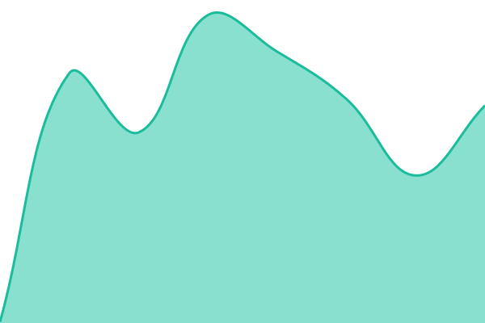
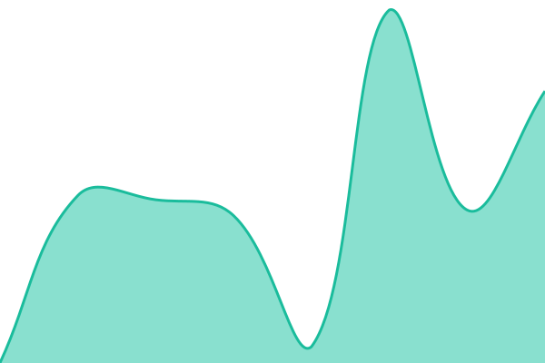
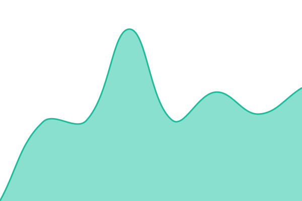
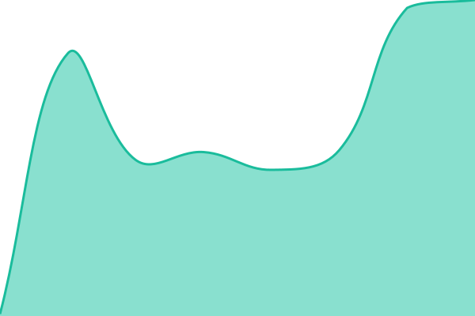
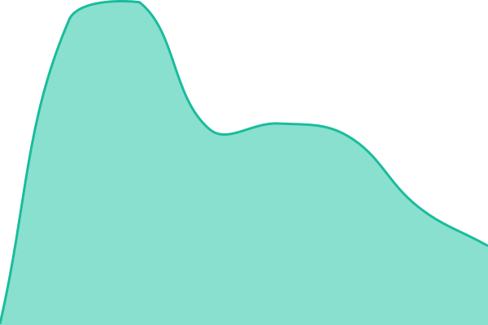
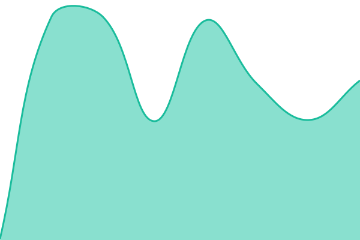
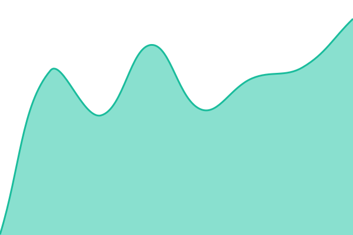

# [📈 Live Status](https://status.delivami.com): <!--live status--> **🟧 Partial outage**

This repository contains the open-source uptime monitor and status page for [Delivami](delivami.com), powered by [Upptime](https://github.com/upptime/upptime).

With [Upptime](https://upptime.js.org), you can get your own unlimited and free uptime monitor and status page, powered entirely by a GitHub repository. We use [Issues](https://github.com/delivami/status/issues) as incident reports, [Actions](https://github.com/delivami/status/actions) as uptime monitors, and [Pages](https://status.delivami.com) for the status page.

<!--start: status pages-->
<!-- This summary is generated by Upptime (https://github.com/upptime/upptime) -->
<!-- Do not edit this manually, your changes will be overwritten -->
<!-- prettier-ignore -->
| URL | Status | History | Response Time | Uptime |
| --- | ------ | ------- | ------------- | ------ |
|  [Marketing Site](https://delivami.com) | 🟩 Up | [marketing-site.yml](https://github.com/delivami/status/commits/HEAD/history/marketing-site.yml) | 

 251ms
     
 | 

<a href="https://status.delivami.com/history/marketing-site">100.00%</a>
    

|  [Web App](https://app.delivami.com) | 🟩 Up | [web-app.yml](https://github.com/delivami/status/commits/HEAD/history/web-app.yml) | 

 1608ms
     
 | 

<a href="https://status.delivami.com/history/web-app">0.00%</a>
    

|  [Documentation](https://docs.delivami.com) | 🟩 Up | [documentation.yml](https://github.com/delivami/status/commits/HEAD/history/documentation.yml) | 

 1176ms
     
 | 

<a href="https://status.delivami.com/history/documentation">100.00%</a>
    

|  [Changelog](https://changelog.delivami.com) | 🟥 Down | [changelog.yml](https://github.com/delivami/status/commits/HEAD/history/changelog.yml) | 

 0ms
     
 | 

<a href="https://status.delivami.com/history/changelog">0.00%</a>
    

|  [Admin Dashboard](https://admin.delivami.com) | 🟥 Down | [admin-dashboard.yml](https://github.com/delivami/status/commits/HEAD/history/admin-dashboard.yml) | 

 367ms
     
 | 

<a href="https://status.delivami.com/history/admin-dashboard">0.00%</a>
    

|  [Assets CDN](https://assets.delivami.com) | 🟩 Up | [assets-cdn.yml](https://github.com/delivami/status/commits/HEAD/history/assets-cdn.yml) | 

 371ms
     
 | 

<a href="https://status.delivami.com/history/assets-cdn">95.98%</a>
    

|  [Image Proxy](https://images.delivami.com) | 🟩 Up | [image-proxy.yml](https://github.com/delivami/status/commits/HEAD/history/image-proxy.yml) | 

 307ms
     
 | 

<a href="https://status.delivami.com/history/image-proxy">96.01%</a>
    

|  [Realtime Server](https://realtime.delivami.com) | 🟩 Up | [realtime-server.yml](https://github.com/delivami/status/commits/HEAD/history/realtime-server.yml) | 

 137ms
     
 | 

<a href="https://status.delivami.com/history/realtime-server">96.03%</a>
    

|  [AI Service](https://ai.delivami.com) | 🟩 Up | [ai-service.yml](https://github.com/delivami/status/commits/HEAD/history/ai-service.yml) | 

 365ms
     
 | 

<a href="https://status.delivami.com/history/ai-service">96.06%</a>
    

<!--end: status pages-->

[**Visit our status website →**](https://status.delivami.com)

## 📄 License

- Powered by: [Upptime](https://github.com/upptime/upptime)
- Code: [MIT](./LICENSE) © [Anand Chowdhary](https://anandchowdhary.com)
- Data in the `./history` directory: [Open Database License](https://opendatacommons.org/licenses/odbl/1-0/)
